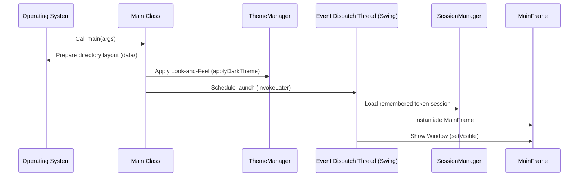

# Main Entrypoint Guide

The [Main](file:///d:/Akhil%20don2/AlgoVerse/src/Main.java) class is the bootstrap entry point launcher of the AlgoVerse application. It performs local storage directory structure preparation, initiates GUI global look-and-feel themes, and opens the main window shell.

---

## Application Startup Sequence



---

## Startup Procedures

### 1. Data Directory Structure Setup
Before initiating any business logic, the application creates a `data/` folder at the root directory of the project to act as the target database container:
```java
new File("data").mkdirs();
new File("data/users.txt").getParentFile().mkdirs();
new File("data/scores.txt").getParentFile().mkdirs();
```
* Ensures the directory paths for user profiles and historical score runs exist to prevent `FileNotFoundException` during file I/O operations inside `FileUtil`.

### 2. Styling System Initialization
* Calls [ThemeManager.applyDarkTheme()](file:///d:/Akhil%20don2/AlgoVerse/src/utils/ThemeManager.java#L45) to load look-and-feel skin mappings and theme constants.

### 3. Thread-Safe GUI Launching
Swing GUI components are not thread-safe. To prevent race conditions during window layout creation, the startup sequence schedules frame creation onto the AWT Event Dispatch Thread (EDT):
```java
SwingUtilities.invokeLater(() -> { ... });
```

### 4. Active Session Restore
* Triggers [SessionManager.loadRememberedSession()](file:///d:/Akhil%20don2/AlgoVerse/src/managers/SessionManager.java#L32) to check for a valid `rememberToken` value from previous login records.

### 5. main window activation
* Instantiates the main controller window [MainFrame](file:///d:/Akhil%20don2/AlgoVerse/src/ui/MainFrame.java).
* Makes the GUI window visible:
  ```java
  MainFrame frame = new MainFrame();
  frame.setVisible(true);
  ```
