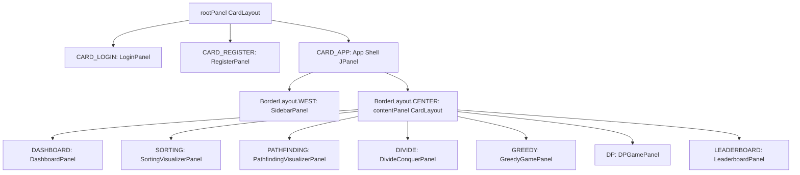

# MainFrame Guide

The [MainFrame](file:///d:/Akhil%20don2/AlgoVerse/src/ui/MainFrame.java) class serves as the central window container and routing orchestrator for the AlgoVerse desktop application. It manages user session views, navigation menus, and screen switching via CardLayout panels.

---

## Window Configurations

* **Superclass**: `JFrame`
* **Default Exit Policy**: `JFrame.EXIT_ON_CLOSE`
* **Dimensions**:
  * Minimum size: `1100 x 680` pixels.
  * Preferred size: `1280 x 760` pixels.
* **Launch Position**: Centered on screen (`setLocationRelativeTo(null)`).
* **Application Icon**: Programmatically generated Unicode lightning bolt emoji "⚡" converted to a buffered vector image via `createTextIcon()`.

---

## Layout Hierarchy & Screen Cards

The layout of `MainFrame` is split into two layers: a root panel layer and an inner app shell layer.



### Registered Screen Cards
1. **[LoginPanel](file:///d:/Akhil%20don2/AlgoVerse/src/ui/LoginPanel.java)**: Handles user authentication queries.
2. **[RegisterPanel](file:///d:/Akhil%20don2/AlgoVerse/src/ui/RegisterPanel.java)**: Handles user account registration.
3. **App Shell**: The main workspace loaded upon successful login, displaying the sidebar and main visualization viewports.

---

## Navigation & Routing System

Screen navigation is controlled by the [navigate(String)](file:///d:/Akhil%20don2/AlgoVerse/src/ui/MainFrame.java#L116) method.

```java
private void navigate(String panel)
```

### Operations Executed During Navigation:
1. **Session Gate**: If the requested panel is `"LOGIN"`, it swaps the root CardLayout viewport back to the login screen cards.
2. **Viewport Swapping**: Flips the inner `contentPanel` CardLayout viewport to the designated screen string.
3. **Sidebar Updates**: Calls `sidebar.setActivePanel(panel)` to highlight the active menu item.
4. **Dynamic Sidebars**: Checks if the target panel implements the [AlgorithmModule](file:///d:/Akhil%20don2/AlgoVerse/src/ui/AlgorithmModule.java) interface:
   * **If Yes**: Fetches algorithm array tags via `am.getAlgorithms()` and registers the selection listener callback `am::onAlgorithmSelected` inside the sidebar.
   * **If No**: Clears the sidebar options (`sidebar.setAlgorithmOptions(null, null)`).
5. **Data Refresh Hooks**:
   * Navigating to `"DASHBOARD"` calls `dashboardPanel.refresh()` to fetch updated user XP stats.
   * Navigating to `"LEADERBOARD"` calls `leaderboardPanel.refresh()` to fetch the updated scoreboard.

---

## Initialization Flow

1. Instantiates directories and checks file existence in [Main](file:///d:/Akhil%20don2/AlgoVerse/src/Main.java).
2. Sets application look-and-feel variables in `ThemeManager`.
3. Constructor performs:
   * Frame layout setup.
   * Card instantiation (`buildRootPanel()`).
   * **Remember Me Auto-Login check**: Calls `SessionManager.getInstance().isLoggedIn()`. If `true`, calls `showApp()` to load the shell immediately; otherwise displays the login screen.
